# Power Query Custom Data Connector for Microsoft Exchange

This Power Query M code defines a custom connector for Microsoft Exchange Online using the Microsoft Graph API.The connector retrieves various data from Exchange Online, such as user events and group calendar views, by making HTTP requests to the Microsoft Graph API endpoints. 

It includes OAuth authentication to securely access the data, handling login, token refresh, and logout processes. 
The connector also provides functions to list events and group calendar views, addressing the limitations of the native Exchange Online connector by offering detailed information on recurring events, occurrences, and modifications to occurrences. 

Additionally, it defines helper functions for making API requests and processing JSON responses. 
The connector is designed to be used within Power BI or other Power Query environments, providing a user-friendly interface and navigation table for accessing the data.

## Table of Contents

- [Power Query Custom Data Connector for Microsoft Exchange](#power-query-custom-data-connector-for-microsoft-exchange)
  - [Table of Contents](#table-of-contents)
  - [Installation](#installation)
    - [Azure](#azure)
    - [Build the Connector](#build-the-connector)
    - [Desktop](#desktop)
    - [Using Functions](#using-functions)
    - [Functions Implemented](#functions-implemented)
    - [User and Groups](#user-and-groups)
    - [Plans](#plans)
    - [On-Premises Gateway](#on-premises-gateway)
  - [Building Connector](#building-connector)
    - [Prerequisites](#prerequisites)
  - [Compile](#compile)
    - [Testing Connector](#testing-connector)

## Installation

### Azure
Due to the manner in which authentication works for the Microsoft Graph API, an app must be registred with delegated permissions (listed below).  This app is then used to make requests to Microsoft Exchange's API endpoints on behalf of the signed in user.

The following describes the steps needed to setup the app service principal and compile the custom connector to work in your tenant.

1. Follow the instructions to [register an app in the Azure Portal](https://learn.microsoft.com/en-us/azure/active-directory/develop/quickstart-register-app).  

2. During that process the redirect URL should be: "https://oauth.powerbi.com/views/oauthredirect.html"

3. Please also add the following Graph API Delegated Permissions

    * Calendars.Read - This allows the user to pull their person calendar.
    * Calendars.Read.Shared - This allows the user to pull the calendar for a group the signed-in user has access to.
    * Calendars.Read.Basic - This allows the user to pull their person calendar.
    * Group.Read.All - This allows the user to pull their groups and find Calendars associated with their groups.
    * Users.Read - Reads basic information about the current user.

If done correctly, the API Permissions should look like Figure 1.

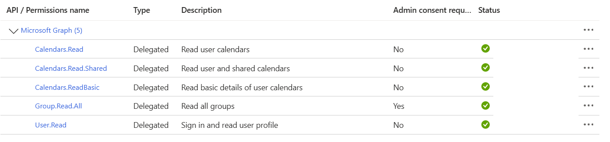

1. Copy the Application ID.

### Build the Connector

Once the app registration is complete, now you need to compile the connector to user the app service principal.

1. Install Visual Studio code: https://code.visualstudio.com/download.

1. Install Power Query SDK for Visual Studio Code: https://github.com/microsoft/vscode-powerquery-sdk

1. Clone this repo to your local machine.

1. Create a client_id.user file in the project folder.

1. <strong>Copy the Application ID into the client_id.user file located in the project.</strong>

1. Using your keyboard, use the shortcut Ctrl+Shift+B.  Visual Studio will prompt you within the command palette to choose a build task. Select the "build: Build connector project using MakePQX".

2. If the build succeeds the .mez file will update in the folder "bin\AnyCPU\Debug".

3. If the build fails the Power Query SDK often presents a notification (see example below).

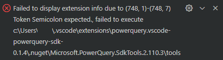

4. Close all Power BI Desktop instances on your local machine.  You are often prompted to do so by Power BI Desktop.

5. Copy the .mez file located in the folder "bin\AnyCPU\Debug" to your folder "Documents\Power BI Desktop\Custom Connectors".  If the folder does not exist, create it first.

### Desktop
1. Open Power BI Desktop and navigate to File -> Options and Settings -> Options.

2. Navigate to GLOBAL -> Security and under "Data Extensions" choose "Allow any extension..."

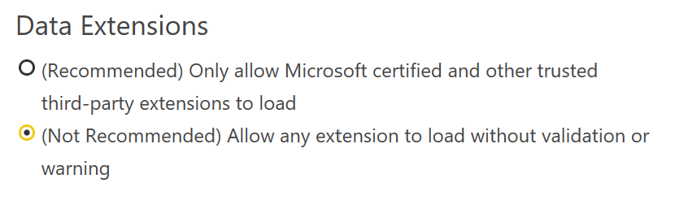

Because this is a custom data connector you have to choose this option in order to use it in Power BI Desktop.

3. Close all Power BI Desktop instances on your local machine.  You are often prompted to do so by Power BI Desktop.

4. Open Power BI Desktop.

5. Select Get Data option.

6. Navigate to the "Other" section and you should see the "Connect to Microsoft Exchange API" connector.

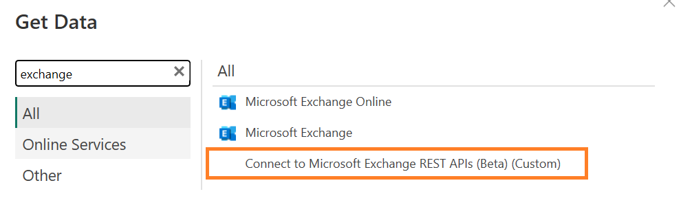

1. Select the connector and press the "Connect" button.

2. You may be prompted with the pop-up below. Choose "Continue".

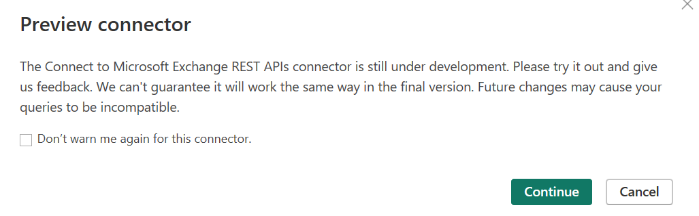

9. If this is your first time using the custom data connector you will be prompted to sign into Office 365. Please follow the instructions to sign in and then choose the "Connect" button.

10. The Navigator prompt will appear (example below).

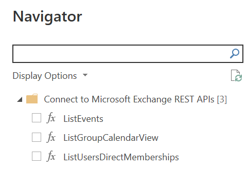

11. Choose the "ListUsersDirectMemberships" option and you should see a json response (see example below).

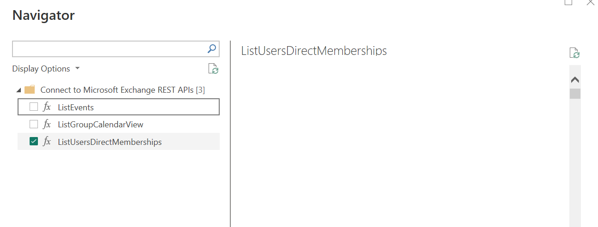

1.  Then choose the "Transform Data" button.  This should open the Power Query Editor.

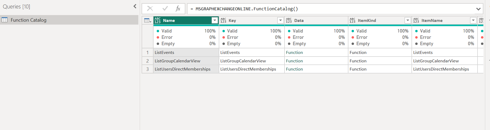

13. Under "Applied Steps", remove the steps "Invoked FunctionGetApps1" and "Navigation".

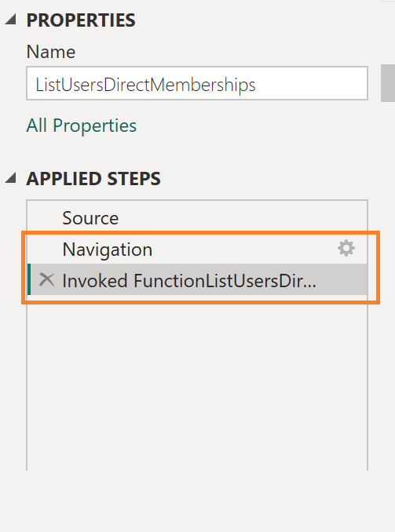

14. You now will see a catalog of the Exchange REST APIs to leverage.  I suggest you rename the Query "ListUsersDirectMemberships" to "Function Catalog".

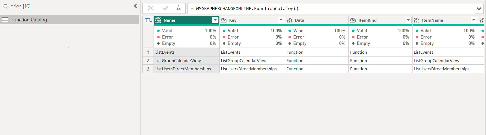

15. I suggest you also uncheck "Enable Load" for the Function Catalog so it doesn't appear in the data model. When disabled the Function Catalog will appear italicized.

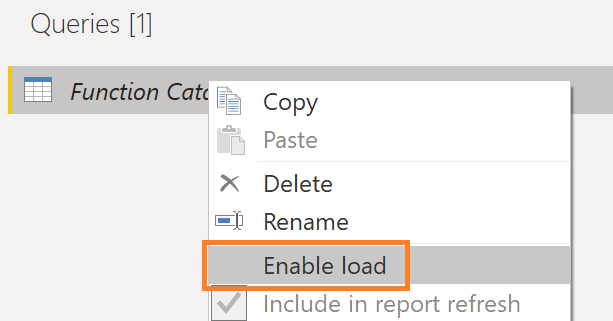

### Using Functions

With the Function Catalog created, please follow these steps to leverage the functions:

1. Identify the name of the function you wish to use. Right-click on the "Function" value located for the appropriate row and select "Add as New Query".

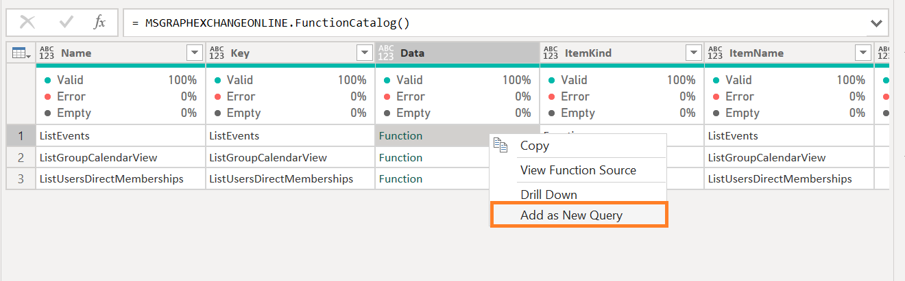

2. The function will be created and it can now be used to query the Power BI service.

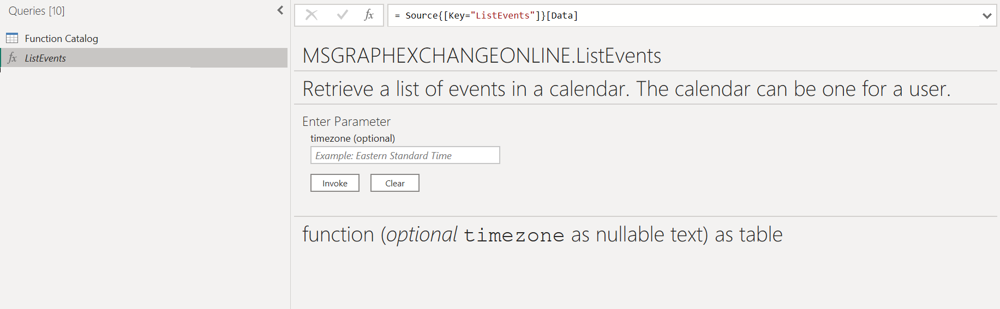

### Functions Implemented

Not all functions from the Microsoft Exchange APIs have been implemented.  Here are the endpoints available at the moment.

### User and Groups
These endpoints are necessary to retrieve plans associated with a group and to get basci profile information (e.g., name, email) for people assigned to a task.
| End Point                      | Description  | MSDN Documentation |
|:-----------------------------|:-------------|:------------------|
| ListUsersDirectMemberships                       | Get groups, directory roles, and administrative units that the user is a direct member of. This operation is not transitive.  | [List a user's direct memberships](https://learn.microsoft.com/en-us/graph/api/user-list-memberof?view=graph-rest-1.0&tabs=http) |

### Plans
| End Point                      | Description  | MSDN Documentation |
|:-----------------------------|:-------------|:------------------|
| ListEvents             | Retrieve a list of event objects for logged-in user.  | [List events](https://learn.microsoft.com/en-us/graph/api/group-list-events?view=graph-rest-1.0&tabs=http) |
| ListGroupCalendarView           | Get the occurrences, exceptions, and single instances of events in a calendar view defined by a time range, from the default calendar of a group.  | [List Group Calendar View](https://learn.microsoft.com/en-us/graph/api/group-list-calendarview?view=graph-rest-1.0&tabs=http) 

### On-Premises Gateway

The custom data connector will need to be installed in the a Power BI Gateway in order to refresh datasets leveraging this custom connector.  For more information on installing a custom data connector with a gateway please see: https://learn.microsoft.com/en-us/power-bi/connect-data/service-gateway-custom-connectors.

## Building Connector

### Prerequisites 

1. Install Visual Studio code: https://code.visualstudio.com/download.
1. Install Power Query SDK for Visual Studio Code: https://github.com/microsoft/vscode-powerquery-sdk
1. Clone this repo to your local machine.

## Compile

In order to the compile the custom data connector to the .mez file, please follow these instructions:

1. Using your keyboard, use the shortcut Ctrl+Shift+B.  Visual Studio will prompt you within the command palette to choose a build task. Select the "build: Build connector project using MakePQX".

2. If the build succeeds the .mez file will update in the folder "bin\AnyCPU\Debug".

3. If the build fails the Power Query SDK often presents a notification (see example below).

### Testing Connector

In order to test the custom data connector, please follow these instructions:

1. Choose the "Set Credential" option within the Power Query SDK. Select AAD and follow the prompts to log into Microsoft 365.

2. The .query.pq file is used to test the custom data connector, please update the section labeled "TEST VARIABLES" for your own environment.

3. When you are ready to test, use the "Evaluate current file" option in the Power Query SDK in the "Explorer" tab.

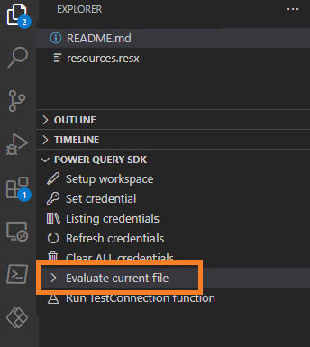

4. When the testing completes, a new tab will be present any failed results or if all the tests passed (example below).

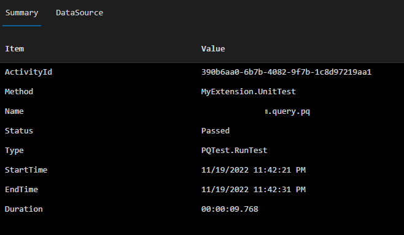
